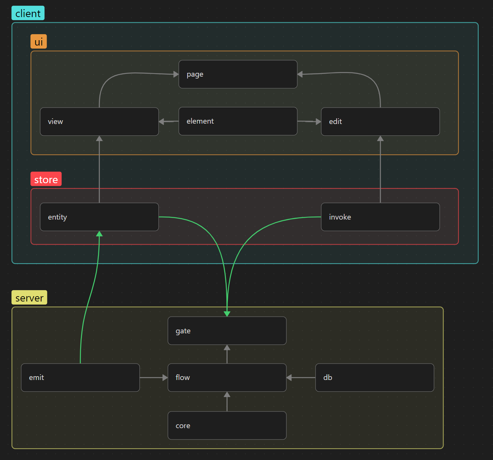

**🇺🇸 English** | [🇷🇺 Русский](./README.ru.md)

---

# US-GFECD Architecture

US-GFECD is an architectural approach for realtime applications with clear separation of responsibilities.

**Client (US):**
- **UI** — handles display. Contains elements (atomic components) that read or modify data.
- **Store** — manages state. Responsible for storing data and sending requests to the server.

**Server (GFECD):**
- **Gate** — entry adapter. Accepts requests from the client and calls Flow.
- **Flow** — orchestrator. Coordinates tasks by calling Core, Db, or Emit.
- **Core** — business logic. Pure functions with rules and calculations.
- **Db** — data access. Works with the database.
- **Emit** — outgoing events. Sends notifications to clients.

---

### Key Principles

Layers are isolated from each other. The upper layer does not know about the internal structure of the lower layer, and the lower layer does not know about the existence of the upper layer. This allows changing the implementation of any layer without affecting others.

---

### General Scheme

The scheme is divided into two parts: client (US) and server (GFECD). Gray arrows show internal connections between layers. Green arrows indicate direct client-server interactions: Entity and Invoke send requests to Gate, Emit sends events to Entity.

---

### Server Layers (GFECD)

#### Gate

**Why:** separate the protocol (WebSocket/HTTP) from business logic.

**What it does:** accepts requests, checks authorization, validates input data, calls Flow.

**What it doesn't do:** does not contain business logic, does not work with the database, does not send events.

---

#### Flow

**Why:** coordinate complex business processes.

**What it does:** calls Core (logic), Db (data), Emit (events). Manages transactions.

**What it doesn't do:** does not contain business rules, does not import Gate.

---

#### Core

**Why:** isolate rules and calculations.

**What it does:** contains business rules, performs calculations and validation. Works with data without side effects.

**What it doesn't do:** does not import Gate, Flow, Db, Emit, does not work with the database.

---

#### Db

**Why:** encapsulate database access.

**What it does:** reads and writes data. Answers questions (e.g., `isUserInRoom`).

**What it doesn't do:** does not contain business logic, does not orchestrate queries.

---

#### Emit

**Why:** send events to clients.

**What it does:** sends events via WebSocket, supports rooms.

**What it doesn't do:** does not contain business logic, does not import Gate, Flow, Core, Db.

---

### Client Layers (US)

#### UI

**Why:** separate presentation from data and logic.

**What it does:** displays data from Store, accepts user input, passes commands to Store.

**What it doesn't do:** does not contain business logic, does not work with the server directly, does not store state (all state is in Store).

**Composition:**
- **Elements** — atomic components without logic (buttons, cards, input fields). Know nothing about Store.
- **View** — read data from Store. Display only. Do not modify data. May use Entity for initialization (data subscription).
- **Edit** — modify data through Store (call Invoke). Do not read data.
- **Page** — assemble View, Edit, and Elements into a page.

---

#### Store

**Why:** manage state and synchronize it with the server.

**What it does:** stores data, processes requests, updates state upon server responses.

**What it doesn't do:** does not contain business logic, does not know about UI.

**Composition:**
- **State** — data and reducers for modifying it. (It's recommended to keep reducers in State, but not required.)
- **Entity** — combines State, initialization (data loading), and subscriptions to server updates. Manages data lifecycle (init/clean).
- **Invoke** — sends requests to the server. Receives responses, updates State through reducers.

> More details about Store implementation in the client library: [@us-gfecd/client](https://npmjs.com/package/@us-gfecd/client)

---

### Data Flows

#### Request

1. **UI** → **Store** (command).
2. **Store** → **Gate** (network request via Socket.IO v4).
3. **Gate** → **Flow** (call).
4. **Flow** → **Core** (logic) and **Db** (data).
5. **Flow** → **Emit** (optional, if other clients need to be notified).
6. Response: **Flow** → **Gate** → **Store** → **UI**.

#### Event

1. **Server event** → **Flow**.
2. **Flow** → **Emit**.
3. **Emit** → **Entity** (on the client) via Socket.IO v4.
4. **Entity** → **State** (update).
5. **State** → **UI** (re-render).